# 42于人类的意义!

### 物质的运动碰撞结合

[布朗运动](https://www.zhihu.com/topic/20054691/intro)
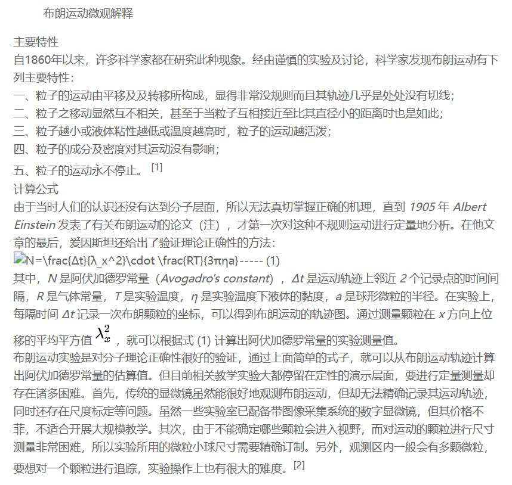

[化学反应](https://baike.baidu.com/item/%E5%8C%96%E5%AD%A6%E5%8F%8D%E5%BA%94/926372)
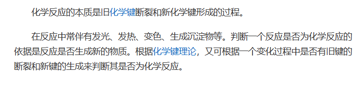

[核子反应](https://baike.baidu.com/item/%E6%A0%B8%E5%8F%8D%E5%BA%94/822469#:~:text=%E6%A0%B8%E5%8F%8D%E5%BA%94%EF%BC%88nuclear%20reaction%EF%BC%89%EF%BC%8C%E6%98%AF%E6%8C%87%20%E5%8E%9F%E5%AD%90%E6%A0%B8%20%E4%B8%8E%E5%8E%9F%E5%AD%90%E6%A0%B8%EF%BC%8C%E6%88%96%E8%80%85%E5%8E%9F%E5%AD%90%E6%A0%B8%E4%B8%8E%E5%90%84%E7%A7%8D%E7%B2%92%E5%AD%90%EF%BC%88%E5%A6%82%20%E8%B4%A8%E5%AD%90,%EF%BC%8C%20%E4%B8%AD%E5%AD%90%20%EF%BC%8C%20%E5%85%89%E5%AD%90%20%E6%88%96%E9%AB%98%E8%83%BD%E7%94%B5%E5%AD%90%EF%BC%89%E4%B9%8B%E9%97%B4%E7%9A%84%E7%9B%B8%E4%BA%92%E4%BD%9C%E7%94%A8%E5%BC%95%E8%B5%B7%E7%9A%84%E5%90%84%E7%A7%8D%E5%8F%98%E5%8C%96%E3%80%82)
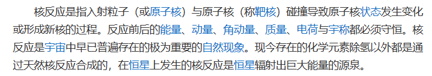

[原子共振]()
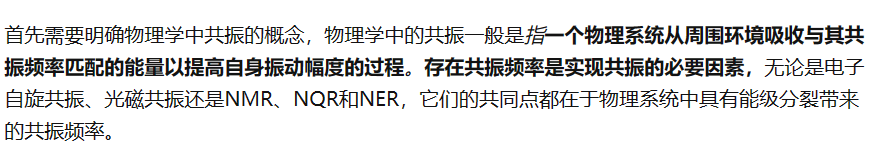

[原子振动频率](https://baike.baidu.com/item/%E5%8E%9F%E5%AD%90%E6%8C%AF%E5%8A%A8%E9%A2%91%E7%8E%87/12717976)
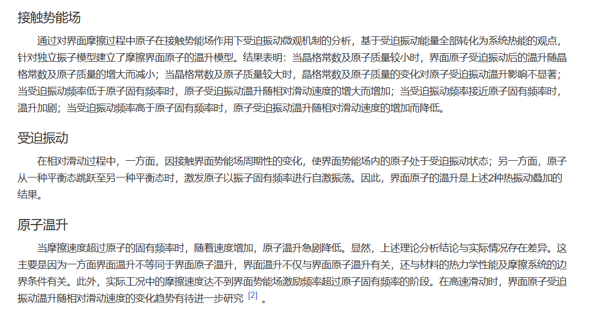

[能量守恒](https://baijiahao.baidu.com/s?id=1650710162219134601)
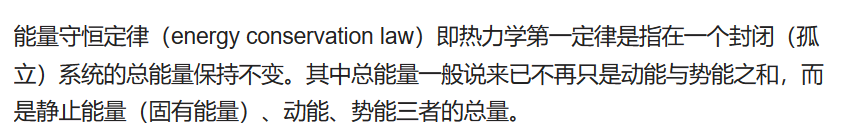

[能量](https://baike.baidu.com/item/%E8%83%BD%E9%87%8F/13016314)

### 物质不断的运动碰撞 , 在小范围内产生了合适的环境有机物诞生了

[米勒实验](https://baike.baidu.com/item/%E7%B1%B3%E5%8B%92%E5%AE%9E%E9%AA%8C/1966928)

(生物是物质演变的过程之一)

### 有机物诞生后小概率下产生了可复制自身结构形式的有机物产生 , 这种有机物不断的复制自身也不断的与环境(自身也是环境)互动(包括利用环境与对抗环境)发生突变以更适合在此环境留存(不适合的都分解变回基本"物质") , 经过不断的进行这一过程 , 有机物形式越来越复杂的逐渐地 , 现代人类定义的生物出现(有机物无机物生物的概念区别是人类自身为了加强自身理解"创造"出来的概念) , 

### 人类

### 性 : 根据筛选规律 , 人类没有发展出更高级的复制形式前 , 性欲旺盛的人类必然是多数 , (宏观看没有性欲的人类不生孩子 , 留下后代的就是有性欲的人类)(性欲过于旺盛的也不会多 , "人类互为竞争关系即人类自身亦为环境" , 人类会处决占用过多性资源的人类)     (文化也是类似过程)

### 智慧 : 智慧是可复制物质为了生存(继续复制过程)"进化"(即能在当前环境维自身的留存不能则消解)出来的 (自身亦是环境的一部分),智慧的定义或者说判定 发现环境规律解决问题的能力 , 人类在这项这项能力较为突出 

### 也有其他生物拥有其他形式的能力用来维持自身生存(存在 , 复制过程),

[硫细菌](https://baike.baidu.com/item/%E7%A1%AB%E7%BB%86%E8%8F%8C/2885263)

[生物技能](https://new.qq.com/rain/a/20210816A0EXDB00)
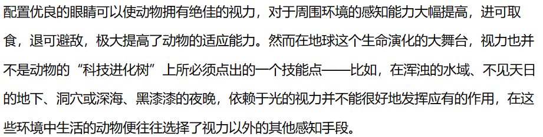

### 无物质无灵魂(或者说无法体现灵魂)

[电子大脑](https://www.ithome.com/0/260/104.htm)

[人脑细胞在培养皿中学会打游戏](https://www.ithome.com/0/593/257.htm)

[人类的细胞群已经可以和小鼠的细胞完成初步结合](https://m.ithome.com/html/647882.htm)
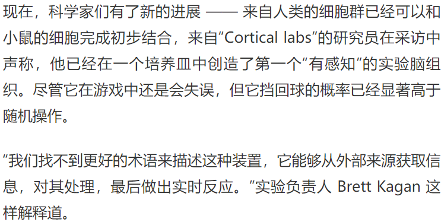

[盖奇脑损](https://www.jianshu.com/p/2fd101a184e6)
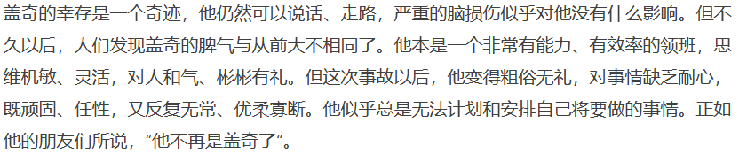

[大脑扫描器可预测人类即将发生的行为决定](https://news.sciencenet.cn/htmlpaper/20084151419292111856.html)
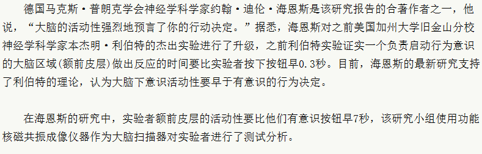

### (以上实验证明无物质无法体现灵魂)

### 关于缸中之脑 : 如果我们是缸中之脑 , 那么制造缸中之脑 , 的也可能是缸中之脑 , (即使是错的人类只能在自身认知范围内做出选择 , 即人类目前局限于此 , 即对人类来说这不是对错问题 , 试错本身也是获取信息的方法)

[不可检测的喷火龙-奥卡姆剃刀](https://zhuanlan.zhihu.com/p/130009023)
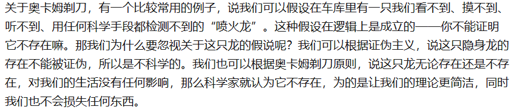

### 外星人 : 如果外星人也是类似形式"进化"出来也必然符合此规律

### 关于现存人类种族差异 , 狗由人用狼作为筛选 , 留下温顺的品种即成为了狗 , 人亦如此例中国人较为温顺 , 古代把叛逆的人处决留下温顺的人 , 文化亦同理 (人自身亦为环境),

### 人类自身进化技术干预需要明确 , 把人类看作一个整体 , 从基因层面人类互相要有基因交流信息(目前形式是交配) , 人类日常交流维持文化交流 , 这样维持人类在一定程度上的整体性 , 且在导向上也要注意思想和基因上的关于人类的认同 , 否则人类未来不是一个整体以后人类可能会消失包括精神层面与物质层面 , 在这同时也要也要保持个体独立性 , 这保证了人类在往多方面发展 , 环境突变时亦有更多机会 (环境灾难是亦可能是希望的火种),

[费米伯伦](https://baike.baidu.com/item/%E8%B4%B9%E7%B1%B3%E6%82%96%E8%AE%BA/10937023)
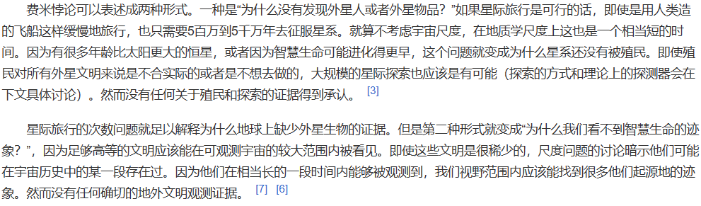

### 人类从诞生以来就有自身的基础使命从物质或者人类自认的精神层面都是如此那即是保存人类自身存在(复制过程) , 所以人类需要形成集体发展共识 , 

# 人类是物质演变过程