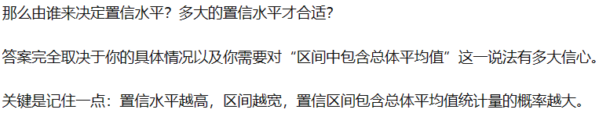

# links 杂谈吗

### 想用遗传迭代算法更直观地展示这个概念 , 但我对遗传迭代算法的了解是不够的 , 

### 概念接受还是不接受其实我认为不如给他放置一个置心度

[置](https://baike.baidu.com/item/%E7%BD%AE%E4%BF%A1%E5%BA%A6/7908802) [信](https://baike.sogou.com/v7790904.htm) [度](https://www.zhihu.com/question/24801731)

## 参考

帕斯卡:人是会思考的芦苇 

笛卡尔:我思故我在

罗素留言:https://www.bilibili.com/video/BV1jy4y177NG

感觉这些文章还挺有趣的可以看 , 

# 参考链接
[布朗运动https://www.zhihu.com/topic/20054691/intro](https://www.zhihu.com/topic/20054691/intro)

[化学反应https://baike.baidu.com/item/%E5%8C%96%E5%AD%A6%E5%8F%8D%E5%BA%94/926372](https://baike.baidu.com/item/%E5%8C%96%E5%AD%A6%E5%8F%8D%E5%BA%94/926372)

[核子反应https://baike.baidu.com/item/%E6%A0%B8%E5%8F%8D%E5%BA%94/822469#:~:text=%E6%A0%B8%E5%8F%8D%E5%BA%94%EF%BC%88nuclear%20reaction%EF%BC%89%EF%BC%8C%E6%98%AF%E6%8C%87%20%E5%8E%9F%E5%AD%90%E6%A0%B8%20%E4%B8%8E%E5%8E%9F%E5%AD%90%E6%A0%B8%EF%BC%8C%E6%88%96%E8%80%85%E5%8E%9F%E5%AD%90%E6%A0%B8%E4%B8%8E%E5%90%84%E7%A7%8D%E7%B2%92%E5%AD%90%EF%BC%88%E5%A6%82%20%E8%B4%A8%E5%AD%90,%EF%BC%8C%20%E4%B8%AD%E5%AD%90%20%EF%BC%8C%20%E5%85%89%E5%AD%90%20%E6%88%96%E9%AB%98%E8%83%BD%E7%94%B5%E5%AD%90%EF%BC%89%E4%B9%8B%E9%97%B4%E7%9A%84%E7%9B%B8%E4%BA%92%E4%BD%9C%E7%94%A8%E5%BC%95%E8%B5%B7%E7%9A%84%E5%90%84%E7%A7%8D%E5%8F%98%E5%8C%96%E3%80%82](https://baike.baidu.com/item/%E6%A0%B8%E5%8F%8D%E5%BA%94/822469#:~:text=%E6%A0%B8%E5%8F%8D%E5%BA%94%EF%BC%88nuclear%20reaction%EF%BC%89%EF%BC%8C%E6%98%AF%E6%8C%87%20%E5%8E%9F%E5%AD%90%E6%A0%B8%20%E4%B8%8E%E5%8E%9F%E5%AD%90%E6%A0%B8%EF%BC%8C%E6%88%96%E8%80%85%E5%8E%9F%E5%AD%90%E6%A0%B8%E4%B8%8E%E5%90%84%E7%A7%8D%E7%B2%92%E5%AD%90%EF%BC%88%E5%A6%82%20%E8%B4%A8%E5%AD%90,%EF%BC%8C%20%E4%B8%AD%E5%AD%90%20%EF%BC%8C%20%E5%85%89%E5%AD%90%20%E6%88%96%E9%AB%98%E8%83%BD%E7%94%B5%E5%AD%90%EF%BC%89%E4%B9%8B%E9%97%B4%E7%9A%84%E7%9B%B8%E4%BA%92%E4%BD%9C%E7%94%A8%E5%BC%95%E8%B5%B7%E7%9A%84%E5%90%84%E7%A7%8D%E5%8F%98%E5%8C%96%E3%80%82)

[原子共振https://zhuanlan.zhihu.com/p/120407692](https://zhuanlan.zhihu.com/p/120407692)

[原子振动频率https://baike.baidu.com/item/%E5%8E%9F%E5%AD%90%E6%8C%AF%E5%8A%A8%E9%A2%91%E7%8E%87/12717976](https://baike.baidu.com/item/%E5%8E%9F%E5%AD%90%E6%8C%AF%E5%8A%A8%E9%A2%91%E7%8E%87/12717976)

[能量守恒https://baijiahao.baidu.com/s?id=1650710162219134601](https://baijiahao.baidu.com/s?id=1650710162219134601)

[能量https://baike.baidu.com/item/%E8%83%BD%E9%87%8F/13016314](https://baike.baidu.com/item/%E8%83%BD%E9%87%8F/13016314)

[米勒实验https://baike.baidu.com/item/%E7%B1%B3%E5%8B%92%E5%AE%9E%E9%AA%8C/1966928](https://baike.baidu.com/item/%E7%B1%B3%E5%8B%92%E5%AE%9E%E9%AA%8C/1966928)

[清洁鱼https://baike.baidu.com/item/%E6%B8%85%E6%B4%81%E9%B1%BC/5289517](https://baike.baidu.com/item/%E6%B8%85%E6%B4%81%E9%B1%BC/5289517)

[陆地蜗牛https://baike.baidu.com/item/%E9%99%86%E5%9C%B0%E8%9C%97%E7%89%9B/13130069](https://baike.baidu.com/item/%E9%99%86%E5%9C%B0%E8%9C%97%E7%89%9B/13130069)

[硫细菌https://baike.baidu.com/item/%E7%A1%AB%E7%BB%86%E8%8F%8C/2885263](https://baike.baidu.com/item/%E7%A1%AB%E7%BB%86%E8%8F%8C/2885263)

[生物技能https://new.qq.com/rain/a/20210816A0EXDB00](https://new.qq.com/rain/a/20210816A0EXDB00)

[电子大脑https://www.ithome.com/0/260/104.htm](https://www.ithome.com/0/260/104.htm)

[人脑细胞在培养皿中学会打游戏https://www.ithome.com/0/593/257.htm](https://www.ithome.com/0/593/257.htm)

[人类的细胞群已经可以和小鼠的细胞完成初步结合https://m.ithome.com/html/647882.htm](https://m.ithome.com/html/647882.htm)

[盖奇脑损https://www.jianshu.com/p/2fd101a184e6](https://www.jianshu.com/p/2fd101a184e6)

[大脑扫描器可预测人类即将发生的行为决定https://news.sciencenet.cn/htmlpaper/20084151419292111856.html](https://news.sciencenet.cn/htmlpaper/20084151419292111856.html)

[缸中之脑https://baike.baidu.com/item/%E7%BC%B8%E4%B8%AD%E4%B9%8B%E8%84%91/6185744](https://baike.baidu.com/item/%E7%BC%B8%E4%B8%AD%E4%B9%8B%E8%84%91/6185744)

[不可检测的喷火龙-奥卡姆剃刀https://zhuanlan.zhihu.com/p/130009023](https://zhuanlan.zhihu.com/p/130009023)

[生态位https://www.jianshu.com/p/3434000d751d](https://www.jianshu.com/p/3434000d751d)    [与https://zhuanlan.zhihu.com/p/114027687](https://zhuanlan.zhihu.com/p/114027687)   [选择压https://www2.jianshu.com/p/117d9f405528](https://www2.jianshu.com/p/117d9f405528)

[幽默的科技三定律https://zhuanlan.zhihu.com/p/25555303](https://zhuanlan.zhihu.com/p/25555303)

[特修斯之船https://baike.baidu.com/item/%E5%BF%92%E4%BF%AE%E6%96%AF%E4%B9%8B%E8%88%B9/19890027](https://baike.baidu.com/item/%E5%BF%92%E4%BF%AE%E6%96%AF%E4%B9%8B%E8%88%B9/19890027)

[费米伯伦https://baike.baidu.com/item/%E8%B4%B9%E7%B1%B3%E6%82%96%E8%AE%BA/10937023](https://baike.baidu.com/item/%E8%B4%B9%E7%B1%B3%E6%82%96%E8%AE%BA/10937023)

[动物的社会行为https://zhidao.baidu.com/question/206592270.html](https://zhidao.baidu.com/question/206592270.html)

[双缝干涉实验https://www.zhihu.com/question/64477778](https://www.zhihu.com/question/64477778) [延迟选择实验https://baike.baidu.com/item/%E5%BB%B6%E8%BF%9F%E9%80%89%E6%8B%A9%E9%87%8F%E5%AD%90%E6%93%A6%E9%99%A4%E5%AE%9E%E9%AA%8C?fromModule=lemma_search-box](https://baike.baidu.com/item/%E5%BB%B6%E8%BF%9F%E9%80%89%E6%8B%A9%E9%87%8F%E5%AD%90%E6%93%A6%E9%99%A4%E5%AE%9E%E9%AA%8C?fromModule=lemma_search-box) [延迟选择实验解释https://zhuanlan.zhihu.com/p/32177147](https://zhuanlan.zhihu.com/p/32177147) [量子纠缠https://baike.baidu.com/item/%E9%87%8F%E5%AD%90%E7%BA%A0%E7%BC%A0/1714985](https://baike.baidu.com/item/%E9%87%8F%E5%AD%90%E7%BA%A0%E7%BC%A0/1714985)

[置https://baike.baidu.com/item/%E7%BD%AE%E4%BF%A1%E5%BA%A6/7908802](https://baike.baidu.com/item/%E7%BD%AE%E4%BF%A1%E5%BA%A6/7908802) [信https://baike.sogou.com/v7790904.htm](https://baike.sogou.com/v7790904.htm) [度https://www.zhihu.com/question/24801731](https://www.zhihu.com/question/24801731)